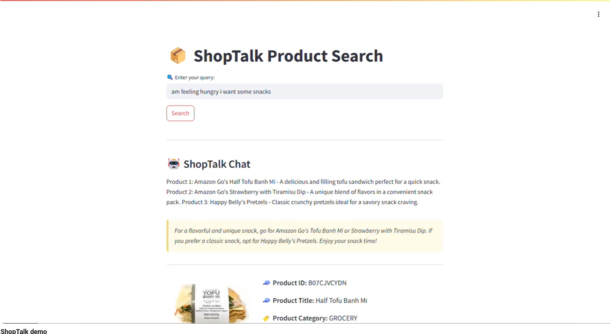

# ShopTalk

A product search assistant that takes natural language queries (like "am feeling hungry i want some snacks" or "brown formal shoes for men") and returns relevant products with images and a short comparison. Built as a RAG system over a ~60K product catalog, using hybrid retrieval and an LLM for the final recommendation.

[Demo video](https://youtu.be/p5Fs53gpW2g)



## How it works

User types a query. The system extracts intent (category, color, brand), runs vector search (Milvus) and keyword search (BM25) in parallel, reranks using four scoring components, sends the top 3 products to GPT-3.5 for a conversational recommendation, and displays product cards with images and metadata.

```
User Query → Streamlit UI → FastAPI backend
                                   ↓
              ┌───────────────┼───────────────┐
           Milvus           BM25           Intent
          (vector)        (keyword)      extraction
              └───────────────┼───────────────┘
                              ↓
             Hybrid reranking (4-component scoring)
                              ↓
                  GPT-3.5 recommendation
                              ↓
               Product cards + images (S3)
```

## Key decisions and tradeoffs

**Why hybrid retrieval?** Vector search alone missed exact keyword matches (specific brand names, model numbers). BM25 alone missed semantic matches ("brown sandals" wouldn't find "leather ankle boots"). I combined both with intent-based attribute matching to cover the gaps.

The four reranking components are weighted: vector similarity (0.4), text match (0.3), intent match (0.2), BM25 (0.1). Tuned manually against an 8-query test set. The test set was too small to justify automated optimization, so I left these as hand-tuned weights.

**Embedding model selection.** I evaluated 6 models: BGE-small, MiniLM, multiqa-MPNet, all-MPNet, BGE-large, and E5-large. BGE-small won on precision-latency tradeoff. BGE-large was marginally better on relevance but noticeably slower, and at ~60K products the difference wasn't worth it.

I tried LLM-based reranking (using GPT to re-order results) but latency jumped from ~3s to ~6s. Killed that approach and stuck with the scoring-based reranker.

**Milvus over Chroma.** Chroma was simpler to set up but Milvus was faster at query time with better filtering support at this catalog size.

**GPT-3.5 for the final response.** I tested DistilGPT2, FLAN-T5 (small/base/large), and BART-large-CNN first. None produced usable product recommendations even after prompt tuning. GPT-3.5 was the only model that could summarize and compare products coherently.

**Data balancing.** The source dataset (Amazon Berkeley Objects) was >50% phone cases. I capped each category at 10% of the dataset and filtered to English-only metadata to reduce retrieval bias.

**Image captioning with BLIP.** Tested BLIP, OFA, and PaliGemma. BLIP-base produced the most product-relevant captions. These captions were added to product metadata before embedding, which is what makes the retrieval multimodal.

## Latency

Started at >10 seconds end-to-end. Got it under 3 seconds by precomputing embeddings and BM25 indexes, switching from Chroma to Milvus, dropping LLM-based reranking, and uploading only the images actually referenced in the final dataset to S3.

## Stack

- **Backend:** FastAPI, Python
- **Vector DB:** Milvus (on EC2)
- **Search:** BM25 (rank-bm25) + Milvus vector search
- **Embeddings:** SentenceTransformers (BGE-small)
- **Image captioning:** BLIP (Salesforce/blip-image-captioning-base)
- **LLM:** OpenAI GPT-3.5-turbo
- **Frontend:** Streamlit
- **Infra:** AWS EC2 (g4dn.xlarge), S3, Docker

## Known limitations

Evaluation is based on an 8-query manual test set. Good enough to validate the approach, but not rigorous enough for production. With more evaluation data, the reranking weights could be learned rather than hand-tuned.

~7.4% of image captions came back as "[undetermined product]" from BLIP. I left these as-is rather than filtering them out, which sometimes produces unhelpful results.

No multi-turn conversation; each query is independent. No user auth or session persistence.

## How to run

Requires Docker, an OpenAI API key, and AWS credentials for S3 image access.

1. Clone the repo
2. Create `.env` file with your credentials (see `.env.example`)
3. Start Milvus: `docker compose up -d`
4. Start backend: `docker-compose -p backend -f docker-compose-backend.yml up -d`
5. Start frontend: `docker-compose -p frontend -f docker-compose-frontend.yml up -d`
6. Open `http://localhost:8501`

## Data

Built on the [Amazon Berkeley Objects (ABO) dataset](https://amazon-berkeley-objects.s3.amazonaws.com/index.html). ~60K products after filtering and category capping.
